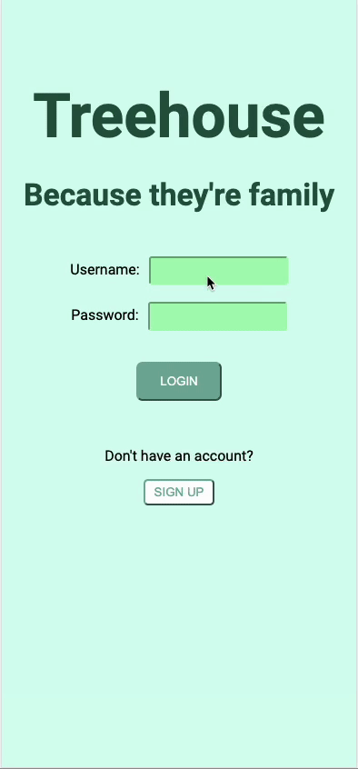

  

 

A Family Tree and Contact Directory

 

Sunlyte is a mobile application that lets you keep track of your family tree and access your family members' contact info!

 

## Built With

# Overview

Upon logging in, Treehouse allows users to click through their family tree! On each family member's profile card, you're able to see their parents, spouse, and all of their children. We've provided a seamless process for users to be able to navigate through even the most complicated family trees, with everyone's contact information right at your fingertips.  

And if the user wants to expand their tree, simply click the button for whichever relative they're adding, and complete the provided contact form!

 

# Want to Contribute?

Have an idea for how we can improve any of our codebases or libraries? We would love your help! If you would like to contribute, please use the following format:

1. Fork the Github repository into your Github account
2. Clone your forked repository and create a new branch using your Github username as the name of your new branch
3. Commit the changes you'd like to contribute to your branch. Use a detailed description explaining what your code helps to optimize or fix
4. Create a pull request into the main branch of the Treehouse repository

# Want to Raise an Issue to Our Attention?

You can also raise an issue in Github if you'd like to bring one to our attention. We are genuinely grateful that you'd like to help make our developer tool better. If you'd like to raise an issue, we'd prefer that you use the following format:

1. What is the problem?
2. What did I expect to happen?
3. What have I tried?
4. (If applicable) Why I suspect it's not working

